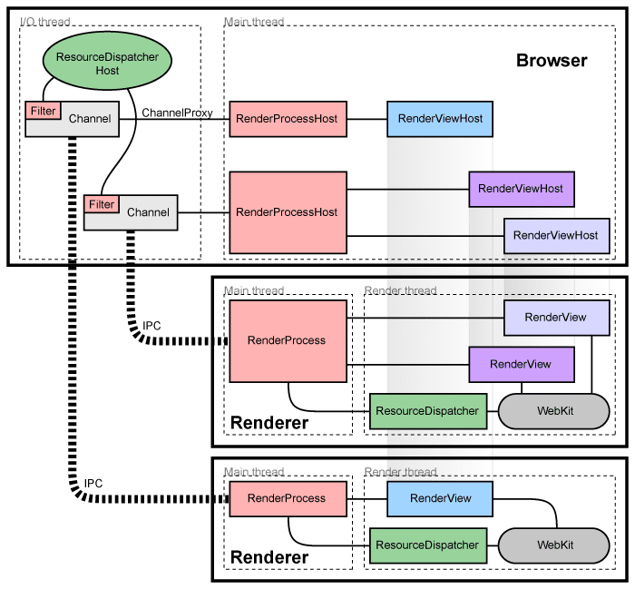

# AriadneOS

## Introduzione

AriadneOS è un message-based microkernel orientato ai servizi web. Le applicazioni user-space che forniscono i servizi sono eseguite nello stesso spazio di memoria del kernel e senza privilege levels da parte della CPU. Il meccanismo di isolamento dei processi avviene viene software, tanto che i processi sono chiamati Software-Isolated Processes (SIPs). L'isolamento via software avviene grazie alla combinazione di software scritto nel linguaggio memory-safe Rust, all'esecuzione di istruzioni interpretate(*) descritte in Web Assembly (WASM) e possibilmente in futuro a verificatori statici. 

## Software-Isolated Processes

Nel progetto sperimentale SingularityOS, viene proposto l'isolamento via software tramite in parte l'utilizzo del linguaggio Sing#, derivato da C#, realizzato per fornire un'analisi statica del codice che garantisca la memory-safety del programma. Essendo inoltre derivato da C#, gode anche di un type checker che garantisca la validità delle operazioni sui dati. Le stesse proprietà sono oggi possedute da Rust, che possiede un compilatore che implementa lo stato dell'arte dell'analisi statica per quanto riguarda la memory safety oltre che avere un type checker moderno. In particolare permette di operare in maniera safe su dati a basso livello come puntatori, buffer, tipi primitivi a 8, 32 o 64 bit; un requisito fondamentale per un linguaggio per sistemi operativi. Errori come use-after-free, out-of-bounds access, dangling pointers, race condition, buffer overflow sono controllati staticamente permettendo al programmatore di scrivere codice a basso livello concorrente e sicuro.

Oltre all'utilizzo di Sing#, SingularityOS garantisce ulteriore sicurezza tramite l'utilizzo di programmi  compilati col linguaggio Microsoft Intermediate Language (MSIL), un linguaggio CPU-independent. Il SO poi compila MSIL verso codice nativo della macchina (x86) durante l'installazione e verificando che gli invarianti di Singularity siano rispettati. Ad esempio viene controllata la presenza di cast illeciti, di accessi di memoria fuori dal SIP o il rispetto del meccanismo di ownership della memoria, ovvero che ogni blocco sia accessibile solo da un thread. Al tempo della pubblicazione di Singularity (2007 circa), gli autori avevano già avviato la ricerca di un Typed Assembly Language che permettesse di verificare la safety di istruzioni assembly. È innegabile dunque che WASM rispetti a pieno queste caratteristiche, essendo un linguaggio con istruzioni a basso livello per una macchina virtuale stack-based. È inoltre typed, tant'è che le istruzioni devono essere validate secondo il type system prima di essere eseguite. È ovviamente un type system molto semplice, progettato per essere verificabile in un singolo passaggio. Tuttavia offre un meccanismo di protezione ulteriore.

Oltre a ciò, WASM garantisce ulteriore sicurezza tramite la separazione della memoria per ogni singolo modulo e la separazione della memoria del codice rispetto a quella dei dati per impedire esecuzione di istruzioni arbitrarie una volta violata la memoria dei dati. Inoltre WASM consente solo istruzioni per uno structured control flow, rendendo impossibili jump di memoria come goto.

L'accoppiata Rust + WASM è dunque una versione moderna ed open di Sing# e MSIL, che sono proprietari di Microsoft. Inoltre Sing# è garbage-collected e gli autori riconoscono nel codice del garbage-collector la principale fonte di codice unsafe in Singularity. Rust invece permette di scrivere codice performante senza l'onere e imprevedibilità di un garbage collector, ma senza incorrere in rischi di memoria come nel caso di C o C++. A differenza di MSIL, WASM è invece anche portabile essendo un linguaggio target che funge da Intermediate representation per altri linguaggi come Rust, C++, Go, Python, AssemblyScript senza quindi vincolare ad un unico linguaggio come Sing# per la realizzazione del software.

## Comunicazione message-based

I processi SIP non condividono memoria, ogni processo può accedere solo ai propri blocchi di memoria. La comunicazione tra processi avviene per scambio di messaggi tramite channel. Lo scambio di messaggi è definito tramite un contratto che specifica i messaggi che il processo può inviare o ricevere o gli stati da esso raggiunto in seguito ad uno scambio. L'idea del contratto è che possa permettere un'ulteriore garanzia di sicurezza e correttezza tramite una verifica statica del contratto tra due processi via analisi esistenti per il Calculus of Communicating Systems (CCS). 

In Singularity, il codice è verificato da un verificatore che controlla solo la conformità agli stati della state machine descritta dal contratto. È possibile tuttavia immaginare in futuro un verificatore che garantisca alcune proprietà sul protocollo di comunicazione via channel tra due processi. Tali proprietà potrebbero essere l'assenza di deadlock e di livelock o conformità rispetto ad una specifica comportamentale. Tutte proprietà oggi dimostrabili in CCS. Sebbene infatti sia più facile implementare due canali unidirezionali, gli autori di Singularity affermano che è più facile verificare canali bidirezionali come in CCS. Agli albori, nei primi esperimenti in Ericsson che hanno portato poi alla nascita di Erlang, vi era l'idea di integrare i costrutti del CCS.

Nel presente, rimanendo con i piedi per terra, lo scambio di messaggi come meccanismo di comunicazione rispetta la filosofia "share by communicating" invece che "communicate by sharing", adottata da Go e derivata da CCS. In questo modo non vi è bisogno dell'utilizzo di aree di memoria condivisa in cui entrambi i processi possono scrivere e leggere, superficie di attacchi di memoria o di concorrenza. Inoltre l'utilizzo di messaggi come Inter-process communication (IPC) permette una più facile analisi di sicurezza e riduce la superficie d'attacco. Anche Chromium utilizza un meccanismo di IPC tramite messaggi attraverso la sua libreria [Mojo](https://github.com/chromium/chromium/blob/master/mojo/README.md).

Anche microkernel del passato usavano una comunicazione via messaggi per garantire maggior isolamento dei processi (compresi drivers, file system e network), tuttavia è indispensabile che tale comunicazione avvenga in maniera performante. A tale scopo, Singularity implementa un'area di memoria condivisa chiamata Exchange heap. Quando un processo invia un messaggio con dati ad un altro processo, viene solo passato il puntatore a quest'ultimo, rendendo l'operazione efficiente senza copia di memoria. Per garantire la sicurezza, vi sono diversi vincoli. Infatti i dati presenti in tale heap possono essere solo struct, non oggetti, e non possono contenere riferimenti ad oggetti. Inoltre il kernel implementa un sistema di ownership tale per cui vi è l'invariante che possa esistere al massimo un puntatore per ogni elemento nel Exchange heap. Quando un processo invia un messaggio, perde il riferimento ad esso e non può più leggerlo o modificarlo. Un meccanismo simile di ownership di messaggi è implementato anche in Mojo in Chromium. E quale linguaggio da usare per implementare tale meccanismo se non Rust stesso?

Come ulteriore prova di validità, anche in Erlang le motivazioni per il message passing sono simili, ovvero evitare che il fallimento di un processo comporti crash di altri processi. Afferma infatti l'autore del linguaggio Armstrong, che "copying data between processes increases process isolation, increases concurrency and simplifies the construction of distributed systems. It wasn’t until we ran Erlang on multicore CPUs that the full benefit of non-shared memory became apparent. On a multicore CPU, message passing is extremely quick and the lack of locking between CPUs allows each CPU to run without waiting for the other CPUs."

Come esempio pratico, FuchsiaOS vede [i filesystem (notare il plurale) come servizi](https://fuchsia.dev/fuchsia-src/concepts/filesystems/filesystems). Essi vivono nel userspace come normali processi con cui interagire tramite channel invece che chiamate di sistema. Il kernel non ha una conoscenza della nozione di file o directory. Qualunque processo che espone un channel in grado di ricevere i messaggi definiti dall'interfaccia può essere visto come un file system, a partire da FS puramente in memoria, a classici FS persistenti fino a vedere il sistema di registrazione dei servizi come un serviceFS (documentazione assente al momento).

## Principio di least-privilege

I processi ricevono solamente le capability minime necessarie per svolgere il loro lavoro. Di default, tutti i processi possono solo eseguire computazione in WASM e quest'ultimo assieme al kernel garantisce che non sia possibile eseguire operazioni come apertura/scrittura di file o di socket di rete.

WASM definisce inoltre il Web Assembly System Interface (WASI) per permettere ai moduli di eseguire chiamate di sistema cross-platform. In particolare WASI è costruito usando principi di sicurezza capability-based. L'accesso a risorse esterne è fornito tramite "handles", i quali sono valori unforgeable, ovvero non vi è modo di forzare tipi di valori illeciti in esso. A livello di implementazione, lo standard WASI consiste di una serie di funzioni importabili all'interno dei moduli WASM e eseguite dal processo host. Quest'ultimo è libero di implementare o aggiungere a proprio piacimento funzioni runtime necessarie per il proprio use case e, per agevolare l'implementazione, esiste già un'implementazione di [libc per WASI](https://github.com/WebAssembly/wasi-libc). Oltre a ciò esiste anche un formato sperimentale per definire API WASI in un Interface Definition Language comune chiamato [witx](https://github.com/WebAssembly/WASI/blob/master/docs/witx.md).

La progettazione dello standard WASI sembra essere simile a quella POSIX per le chiamate di sistema, tuttavia in realtà prende ispirazione dal lavoro fatto per [CloudABI](https://cloudabi.org/) (e dunque a sua volta basato su [Capsicum](https://www.cl.cam.ac.uk/research/security/capsicum/)). Ad esempio attualmente CloudABI possiede solo 49 chiamate di sistema, le cui firme sono anche progettate affinché un modulo WASM possa usare solo le risorse consentite. Ad esempio non esiste la funzione ``open(path)` bensì solo ``openAt(handle)` . Un modulo può manipolare solo i files o le directory esplicitamente passate come handle dal modulo genitore o dal processo host, che a sua volta le riceverà dal kernel. Ogni altro tentativo di leggere o scrivere ad esempio files o socket sarà proibito. Le capability sono inoltre per modulo, riducendo i rischi derivanti da un mondo open-source molto modulare con alto utilizzo di codice di terze parti. Sempre più comuni sono infatti gli attacchi che prendono di mira librerie open-source o addirittura strumenti di sviluppo e compilazione come Eclipse o XCode per distribuire malware. 

I dettagli della specifica delle capability sono purtroppo ancora non chiari. Singularity definisce l'utilizzo di un file manifest che specifichi le risorse, capabilities e dipendenze del programma (processi comunicanti). Tali informazioni sono poi verificate in fase di installazione del programma. Anche FuchsiaOS propone un manifest che descrive il runtime da utilizzare, le capability necessarie tramite [un grafo di ogni componente](https://fuchsia.dev/fuchsia-src/concepts/components/v2/topology#capability-routing) e le capability esposte.

Infine Singularity definisce anche l'utilizzo dei channel come implementazione delle capability. Ovvero una capability non è altro che la possibilità di comunicare attraverso un channel. Qui la faccenda si fa torbida perché in WASI le capabilities sono chiamate di funzioni alla POSIX, mentre in Singularity sono channels. Richiedere l'utilizzo di channels anche per comunicazione tra moduli WASM sembra esagerato, magari solo comunicazione tra SIP dovrebbe avvenire via channel e le capabilities vengono trasformate in funzioni importabili nei moduli WASM interni. L'utilizzo di channel è tuttavia fondamentale per un altro aspetto peculiare di AriadneOS descritto più in avanti, ovvero "everything is a process".

In ogni caso l'ABI è progettato con l'invariante di isolare lo stato dei processi, non permettendo ad un processo di direttamente alterare lo stato di un altro tramite chiamata ABI. Non è possibile quindi ad esempio passare riferimenti ad oggetti. Inoltre le chiamate ABI sono efficienti normali chiamate di funzioni in quanto il SIP esegue al ring0 nello stesso indirizzo di memoria del kernel e senza CPU privilege levels.

Al di là dei dettagli implementativi, sicuramente è un mondo lontano dai permessi per ruolo o per namespace di Linux.

### Sandboxing

La relazione tra l'interprete WASM e il processo host è la stessa dei processi che eseguono in sandbox in Chromium. Il processo host funge da broker e definisce la policy dell'applicazione in base alle capability richieste. Inoltre esegue le effettive chiamate di sistema usando WASI ed assicurando che la policy sia rispettata. L'applicazione WASM che esegue sandboxed rappresenta invece il processo target. Ad esempio in Chromium, il processo host è chiamato browser, mentre quelli target sono chiamati renderer. Quando un renderer ha bisogno di fare una richiesta di rete, invia un messaggio con ID al processo browser, in particolare al IPC thread, che si occuperà di fare l'effettiva operazione IO. 


L'implementazione del sistema di sicurezza in AriadneOS è basato su WASI/CloudABI invece che [seccomp-BPF](https://www.kernel.org/doc/html/v4.16/userspace-api/seccomp_filter.html) come nel caso di Chromium su Linux.

### Concurrency



Un effetto collaterale del sandboxing in Chromium è permettere maggiore concorrenza. Ogni istanza di sito Chromium ha un main thread nel processo browser che aggiorna la UI e un main thread nel processo renderer dove esegue un'istanza di [Blink](https://github.com/chromium/chromium/tree/master/third_party/blink), il renderer engine di Chromium derivato da Webkit. Vi è inoltre per ognuno dei due processi un IO thread che nel browser gestisce le richieste network e l'IPC mentre nel renderer solo l'IPC. Infine ogni processo Chrome ha un thread pool per task generiche.

Grazie al fatto che il thread UI è separato dal thread IO, l'interfaccia è libera di aggiornarsi mentre avviene la richiesta delle risorse, che è la fonte dei messaggi più comuni e critici per le performance.

In Blink, o storicamente in JS, esiste invece un unico main thread che esegue JS, gestisce il DOM, il CSS ed i calcoli di stile e layout (il paint effettivo avviene nel processo browser). Per questo la natura asincrona di JS è fondamentale per evitare che il main thread sia bloccato in attesa di una operazione IO ed ogni computazione non può superare i 16ms, pena il calo del frame rate da 60fps (1000ms / 60 = 16ms). Il suo paradimma asincrono viene talvolta chiamato Continuation Passing Style. Infatti alla base di JS vi è un sistema ad eventi con uno scheduler chiamato event loop, ove le task sono messe in una coda event queue e ogni task può a sua volta aggiungere in coda una nuova task. Tutte le chiamate IO sono invece asincrone, con la funzione callback aggiunta all'event queue quando si verifica l'evento.

Le implicazioni per AriadneOS di tale architettura non sono ancora chiare. Tuttavia ciò potrebbe fornire uno spunto per il meccanismo di concorrenza all'interno di un'applicazione WASM senza la nozione di thread in WASM. Al momento infatti il supporto di thread da parte di WASM è ancora acerbo, con un'implementazione iniziale solo in Firefox 78. Altri compilatori come LLVM assumono che vi sia un unico thread e ad esempio salvano lo stack pointer in una variabile globale.

### Hardware-based protection

Per invece eseguire applicazioni legacy non safe di terze parti, si può aggiungere un livello di protezione hardware ulteriore eseguendo quindi i SIP in una classica memoria virtuale (chiamata protection domain in Singularity) e in addizionalmente anche la protezione via CPU user-mode. Il risultato finale è un classico processo in ring3 come nei sistemi operativi attuali.

A quel punto la comunicazione tra processi richiederà copia di memoria, ma sarà comunque trasparente per il codice dell'applicazione, salvo per le performance. L'utilizzo o meno di protection domain e CPU user-mode può essere definito per singolo processo o gruppi di processi e gestito dal kernel. In questo modo è possibile ottenere diverse configurazioni, dai microkernel a monolithic kernel o ibridi. Oppure un insieme di processi può risiedere nello stesso spazio di memoria virtuale per permettere una comunicazione più veloce senza copia, ma comunque in una memoria virtuale separata dal quella del kernel.


## Everything is a process

Un principio di Erlang è quello di vedere tutto come processo, compreso l'hardware. Questo è diverso da Linux dove invece "everything is a file", in modo da descrivere tutto tramite un file descriptor avente la stessa interfaccia read()/write(). Vedere tutto come un processo significa invece comunicare con l'hardware tramite l'invio di messaggi ad un normale processo. Ciò si presta molto bene per gli scopi e le caratteristiche di Singularity. 

Addirittura in Erlang, un file handle è semplicemente un processo con cui poter comunicare. Questo era qualcosa già pensato anche in Singularity, dove grazie al fatto di avere SIP leggeri, ciò che diviene un processo è molto più granulare. 

Ciò si presta bene anche col sistema capability-based, ove il file system e il network stack sono capability ed il il processo che fornisce tali servizi viene chiamato capability provider. Ciò permette anche di definire diversi file system provider nello stesso SO, così come di usare un file system remoto invece che locale in maniera trasparente. Ai fini dell'applicazione, si tratta sempre di comunicare con un processo (remoto) via channel. Questo significa che i messaggi nel channel sono potenzialmente messaggi HTTP in maniera trasparente ai processi SIP.

Infine anche in Erlang, i processi risiedono tutti nello stesso spazio in memoria senza protezione di memoria hardware e sono parte del linguaggio, piuttosto che del kernel. Tutt'ora ad oggi ci sono pochi sistemi del genere, altri esempi sono i task in Ada. Nel caso di AriadneOS, la protezione dei processi è parte del software e non hardware.

In FuchsiaOS invece "[Everything is a Component](https://fuchsia.dev/fuchsia-src/concepts/components/v2/introduction)", ove un componente è un programma che esegue in sandbox ed interagisce con altri componenti usando una comunicazione IPC via channel. Il termine componente pone l'enfasi sulla separation of concerns, modularità e composizione. I componenti possono essere infatti [composti formando alberi con relazione parent-children](https://fuchsia.dev/fuchsia-src/concepts/components/v2/topology).

Tuttavia così come l'attenzione verso la separation of concerns ha portato alla crescita di uno sviluppo component-based nell'ingegneria del software e successivamente a quella service-oriented nei sistemi distribuiti, possiamo immaginare che AriadneOS punti magari a ragionare a tutto come "servizi". La frase "Everything is ..." riflette la visione che ha il SO delle entità che gestisce. Per Linux, tutto è un file perché tutto è leggibile o scrivibile. Per FuchsiaOS tutto è un componente perché esegue isolato ed in maniera componibile. Per AriadneOS tutto è un servizio perché offre risorse con cui è possibile operare comunicando (via REST) secondo un contratto definito ed in una maniera più ricca del solo read/write (GET/POST in REST). In AriadneOS un servizio è un gruppo di risorse che operano in maniera coesa e secondo un contratto stabilito. Più a basso livello, consiste di un insieme di channel e dei messaggi che è possibile scambiare con essi. Questo shift verso una visione risorse + comunicazione sembra più moderno rispetto al concetto di tutto come processo originale di Erlang, che focalizzava solo sull'aspetto di comunicazione. 

In FuchsiaOS un servizio è invece un gruppo di protocolli FIDL (Fuchsia Interface Definition Language) attraverso un channel.

```
service Netstack {
    fuchsia.net.NameLookup name_lookup;
    fuchsia.posix.socket.Provider socket_provider;
}
```

### Processi granulari

Dato il basso overhead dei SIP, AriadneOS è un microkernel in quanto i drivers, il file system, il network stack e qualsiasi altro servizio è eseguito fuori dal kernel come SIP. Rimane nel kernel lo scheduling, l'accesso privilegiato alle risorse hardware, la gestione della memoria di sistema (come gli Exchange heap), la creazione e distruzione di SIP e channel.

La possibilità di avere processi a basso costo, permetterà anche di incrementare la granularità dell'isolamento. Le implicazioni di tale possibilità sono molto interessanti, come appunto la visione "everything is a process". Lo stesso WASM è progettato per avere una memoria isolata per ciascun modulo all'interno di un programma, permettendo di immaginare un futuro a nanoprocesses come mostrato nel talk [WebAssembly nanoprocesses](https://youtu.be/TF-tXDRAEmg). È possibile figurarsi un futuro in cui operazioni come rispondere ad una richiesta HTTP o eseguire una query del database siano eseguite isolate una dall'altra tramite moduli WASM incorrendo in penalità minime di performance, ma garantendo maggiore protezione tra richieste di utenti diversi eseguite dallo stesso server.

### Scheduler

Anche lo scheduler deve riflettere la natura message-based del kernel e la reattività del sistema. In particolare serve una policy come quella in Singularity che favorisca thread che sono svegliati all'arrivo di un messaggio. Essi eseguono una piccola quantità di lavoro, inviano messaggi altri SIPs e tornano in attesa del prossimo messaggio. Questo tipo di policy danneggerebbe i processi CPU bound, ma task CPU-intensive come nel caso di Machine Learning possono essere eseguiti su un'altra macchina dedicata con cui i processi comunicano transparentemente via REST. Oppure lo scheduler potrebbe riservare una o più CPU appositamente per processi CPU-intensive, una sorta di process-pool.

Lo scheduler qui descritto è ispirato dalla natura fortemente asincrona di JavaScript sia all'interno dei browser che nel runtime Node.js. Quest'ultimo era agli inizi fortemente privilegiati per servizi "real-time" quali chat e messaggi, in quanto Node.js è in grado di gestire un alto numero concorrente di richieste HTTP. Per ogni richiesta, il server esegue una piccola computazione seguita da un'operazione IO come il salvataggio in DB o lettura/scrittura da file. Tuttavia nell'attesa dell'operazione IO, il thread prosegue nel gestire altre richieste. In questo modo il numero totale di thread attivi in ogni istante è basso e non linearmente proporzionale al numero di richieste, purché il lavoro associato ad ogni richiesta sia "piccolo". Nella pratica questo tipo di scheduler si è dimostrato valido per molte tipologie comuni di servizi. Si ritiene dunque che possa far caso anche ad AriadneOS, essendo orientato ai servizi.

In maniera molto simile ad AriadneOS, i processi Erlang sono macchine a stati finiti che cambiano di stato in risposta a messaggi. Quando avviene un evento, fanno una piccola computazione, cambiano stato, mandano messaggi ad altri processi e tornano in attesa del prossimo evento.

In FuchsiaOS, i thread hanno una priorità base che può essere modificata in una priorità ereditata nel caso in cui stiano bloccando un thread a priorità più alta attraverso una risorsa condivisa. L'intento è quello di favorire la reattività dei thread interattivi, ad alta priorità, che interagiscono con l'utente e causano latenza percepibile. Fortunatamente questi in genere eseguono poco lavoro e passano la maggior parte del tempo in attesa del successivo evento dall'utente.

## Distribution as first-class citizen

Finora la descrizione di AriadneOS rispetta a pieno le caratteristiche che, secondo Armstrong, rendono Erlang un sistema Concurrency Oriented:

- Systems are built from processes.
- Process share nothing.
- Processes interact by **asynchronous** message passing.
- Processes are isolated.

In particolare, afferma Armstrong anche che "An Erlang system can be thought of as a communicating network of black boxes. If two black boxes obey the principle of observational equivalence, then for all practical purposes they are equivalent.". Questa definizione sembra quasi presa pari pari dalla teoria del  CCS e sebbene nel contesto originale si riferisca alla concorrenza, si presta bene anche come principi base per un kernel a servizi distribuiti.

Il fattore importante è la interconnessione tra i processi e i protocolli di comunicazione osservati tra i channel dei processi. Già nel 2007, un aspetto che Armstrong pensava fosse importante per il futuro di Erlang era pensare ad una maniera per formalizzare protocolli per la comunicazione interprocess, soprattutto verso processi non Erlang.

La stessa necessità è dunque fortemente presente anche in AriadneOS e ne sarà una caratteristica peculiare. Richiede dunque un'attenta riflessione. Una prima idea è che se tutto è un processo e con il processo si comunica tramite channel, servirà un modo per identificare quest'ultimi e fornire una semantica delle operazioni attraverso i channel. Nel mondo del web, le risorse sono identificate tramite URI e l'architettura REST definisce la semantica delle operazioni su tali risorse. Nel mondo web l'architettura REST è implementata via il protocollo HTTP, tuttavia quest'ultimo non è idoneo per dispositivi resource-constrained come nel caso di IoT. È tuttavia emergente un nuovo protocollo IoT con dimensioni di messaggi ridotte, a basso consumo energetico e di utilizzo della banda, chiamato CoAP e basato su UDP invece che TCP come nel caso di HTTP. Tuttavia CoAP implementa comunque l'architettura REST ed utilizza URI per identificare le risorse, rendendolo compatibile anche con servizi REST HTTP-based esistenti. Questo potrebbe fornire un buon indizio sulla validità dell'utilizzo di un'architettura REST per la comunicazione tra processi e di URI per l'identificazione di risorse, a prescindere da HTTP. In questo modo AriadneOS può comunicare con dispositivi diversi, da server in datacenter a dispositivi embedded locali. Come questo si integri nella pratica con i channels è un mistero ancora irrisolto e che richiede ulteriori riflessioni.

In FuchsiaOS, ogni componente eseguibile è identificato e istanziato tramite un [Component URL](https://fuchsia.dev/fuchsia-src/glossary#component-url) che punta al manifest del programma.

La comunicazione IPC avviene invece via messaggi e utilizzando un IDL ad hoc denominato [Fuchsia Interface Definition Language (FIDL)](https://fuchsia.dev/fuchsia-src/development/languages/fidl). Il termine comprende sia il formato di messaggio inviato, la sintassi del linguaggio, che gli strumenti di compilazione e bindings per i diversi linguaggi client e server. Nel caso di AriadneOS esiste già qualcosa di simile chiamato [witx](https://github.com/WebAssembly/WASI/blob/master/docs/witx.md) ed utilizzato per WASI oppure esiste già [WebIDL](https://developer.mozilla.org/en-US/docs/Mozilla/WebIDL_bindings) sebbene sia specifico per la comunicazione tra JS DOM e renderer.

Tuttavia questo modo di comunicare via IDL ricorda il pattern Remote Procedure Call (RPC) ed è spesso oggetti di discussione in sistemi distribuiti l'utilizzo di RPC (nella implementazione moderna [gRPC](https://grpc.io/)) versus utilizzo di REST. Un successivo approfondimento su tale confronto chiarirà sicuramente quale soluzione sia più adatta per la visione di AriadneOS.

Alcune persone impavide (o forse incoscienti) stanno sperimentando un nuovo OS, chiamato Redox, ove ["Everything is a URL"](https://doc.redox-os.org/book/ch04-03-urls-schemes-resources.html). Tuttavia altri, anche loro autori di nuovi OS, si [oppongono a questa idea](https://github.com/tomaka/redshirt/issues/195). La questione richiede sicuramente ulteriore approfondimento e ragionamento.

### Registro delle applicazioni/container

L'idea per le applicazioni in AriadneOS è che siano scritte in qualsiasi linguaggio, preferibilmente in Rust per evitare gli attacchi di memoria interna del processo, e compilati in WASM. A quel punto viene creato un artefatto con Docker, contenente il file manifest e qualsiasi altra informazione come chiavi o hash necessaria per garantire l'integrità e autenticità dell'applicazione.

L'artefatto deve essere il più leggero possibile e viene inviato ad un registro distribuito come quello di Docker (che probabilmente non è molto distribuito in realtà). In [redshirt](https://github.com/tomaka/redshirt), un SO con runtime WASM in ring0, le applicazioni sono caricate da un InterPlanetary File System (IPFS). 

Una volta scaricato l'artefatto, viene verificata l'autenticità e integrità, viene verificato il manifest, vengono creati i channel per le capability e l'eseguibile WASM è pronto per l'esecuzione direttamente, che sia su un server centralizzato che su dispositivi IoT.

### Integrazione

Infine, la menzione a Docker è importante per rendere il kernel più compatibile possibile con software esistente. A tale scopo, AriadneOS deve permettere di eseguire applicazioni container aventi come target di build la piattaforma WASI. Così come oggi è possibile realizzare build in Docker per Linux o Windows, è possibile un domani che [Docker supporti la piattaforma WASI](https://www.youtube.com/watch?v=rZEQNH27y-k&t=5s) nel nuovo toolkit [moby/buildkit](https://github.com/moby/buildkit). La stessa immagine potrebbe quindi essere eseguita in diverse piattaforme WASI, come le diverse che stanno emergendo per vari contesti quali Blockchain.

FuchsiaOS permette di essere language e runtime agnostic tramite l'utilizzo di diversi Runner, ad esempio ELF Runner, Dart Runner o Web Runner (Chromium). Questo permetterà sicuramente a FuchsiaOS di fungere contemporaneamente da kernel di ChromeOS, Linux e Android e le applicazioni esistenti nelle 3 diverse piattaforme possono essere usate in FuchsiaOS senza lavoro ulteriore. Nel caso invece di AriadneOS viene richiesto agli sviluppatori di compilare le loro applicazioni come WASM per ottenere portabilità. Tuttavia sarebbe un obiettivo molto desiderabile poter supportare un browser come Chromium o Firefox sia per usufruire di applicazioni web con interfaccia che usare questi come motore grafico in generale per la UI del sistema operativo permettendo di realizzare l'interfaccia tramite HTML e CSS, due linguaggi che si sono mostrati idonei e molto più produttivi rispetto ad altre tecnologie GUI.

### Software updates

Grazie alla separazione dei servizi dal kernel, è possibile aggiornare i primi in maniera indipendente da quest'ultimo. In particolare l'idea è che possano essere tenuti aggiornati senza riavvio del sistema come se fossero pagine web. Questo sarebbe un ulteriore vantaggio sia per l'availability che la sicurezza. Questo principio è sottolineato anche da Erlang, che si definisce progettato per programmi concorrenti che "eseguano per sempre". Il fatto che i servizi non richiedano installazione è importante ai fini di questo obiettivo.

## Extra

- È interessante riflettere sui requisiti che hanno guidato alla progettazione di Erlang:
    1. Handling a very large number of concurrent activities
    2. Actions to be performed at a certain point of time or within a certain time
    3. Systems distributed over several computers Interaction with hardware
    4. Very large software systems
    5. Complex functionality such as feature interaction
    6. Continuous operation over several years
    7. Software maintenance (reconfiguration, etc.) without stopping the system
    8. Stringent quality and reliability requirements
    9. Fault tolerance both to hardware failures and software errors
- [LegoOS](https://www.usenix.org/conference/osdi18/presentation/shan) è il primo OS della tipologia splitkernel che separa le risorse hardware CPU, memoria e storage tra di loro non assumendo che siano fisicamente locali. In questo modo è possibile sfruttare maggiormente l'hardware senza lasciare risorse non utilizzate, oltre che rendere il SO nei datacenter più resiliente a fallimenti hardware, CPU compresa. Per ottenere ciò c'è bisogno sia di un nuovo kernel, che nel caso di LegoOS è Linux ABI-compatible, che di nuovo hardware apposito. AriadneOS certamente assume che memoria e CPU risiedano localmente insieme, tuttavia permette almeno per lo storage l'opzione di usare in maniera trasparente hardware remoto.

## Fonti

- [Singularity: Rethinking the Software Stack - 2007](https://dl.acm.org/doi/abs/10.1145/1243418.1243424?casa_token=Typ60GF_XFYAAAAA:IcBKWEFu_1ECRC27bycIDyHk_Uzyae1bIZ5HtWoIQ40Ehq17elV9EMlIZbQUxlIQsx1NVTj-Cuk)
- [Deconstructing Process Isolation - 2006](https://dl.acm.org/doi/abs/10.1145/1178597.1178599?casa_token=yMWCEwqeStUAAAAA:bULeEcUt6Vpv4W1OgEtI6RkeQpjD6Q9p1OhvSQ4z7qETvbqiZ52CO-feeQQAya4OXyyUJM1Ek2E)
- [A history of Erlang - 2007](https://dl.acm.org/doi/abs/10.1145/1238844.1238850?casa_token=iPLci0jkN88AAAAA:-lnXHrLiHAazCKhCG7gFuxec5L9br8a9UQHy9i1dkgZQ-u51wp8Q29C2IasVgtP247azeD7peoM)
- [The Security Architecture of the Chromium Browser - 2008](http://css.csail.mit.edu/6.858/2018/readings/chromium.pdf)
- [GitHub Chromium](https://github.com/chromium/chromium)
- [The Case for Writing a Kernel in Rust](https://dl.acm.org/doi/abs/10.1145/3124680.3124717?casa_token=YkarYxnTQM8AAAAA:gTRQN7hXZiOOJ2vCAqB9lnPEBvjlz33AEYBYgoWZ6141jCnZV9CHheKtadFZwlsTLdyezHes1pU)
- [CoAP: An Application Protocol for Billions of Tiny Internet Nodes - 2012](https://ieeexplore.ieee.org/abstract/document/6159216?casa_token=rW-UYu0Eb9YAAAAA:mkViry9U6_nR5k8_el5XLd_qW-50As7qsNVCKhqvqk9P4Ly0pZeAFq3KAcRa_k9aZmsDPck)
- [Choice of Effective Messaging Protocols for IoT Systems: MQTT, CoAP, AMQP and HTTP - 2017](https://ieeexplore.ieee.org/abstract/document/8088251?casa_token=y5Iv2e9jz7EAAAAA:eKkfCK0uodd70EoI7qr2YDNJP1b3Ex47fsdY71_rvf4jRNW1uHG6TzeYe7KpuAQ8HW0vLfo)

(*): Le istruzioni WASM possono essere sia interpretate che in futuro compilate da un compilatore JIT. È un dettaglio implementativo.
