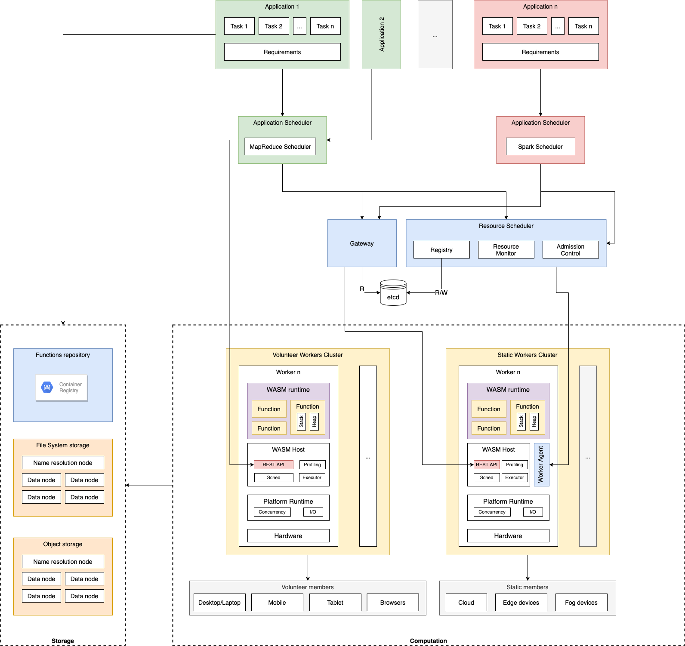
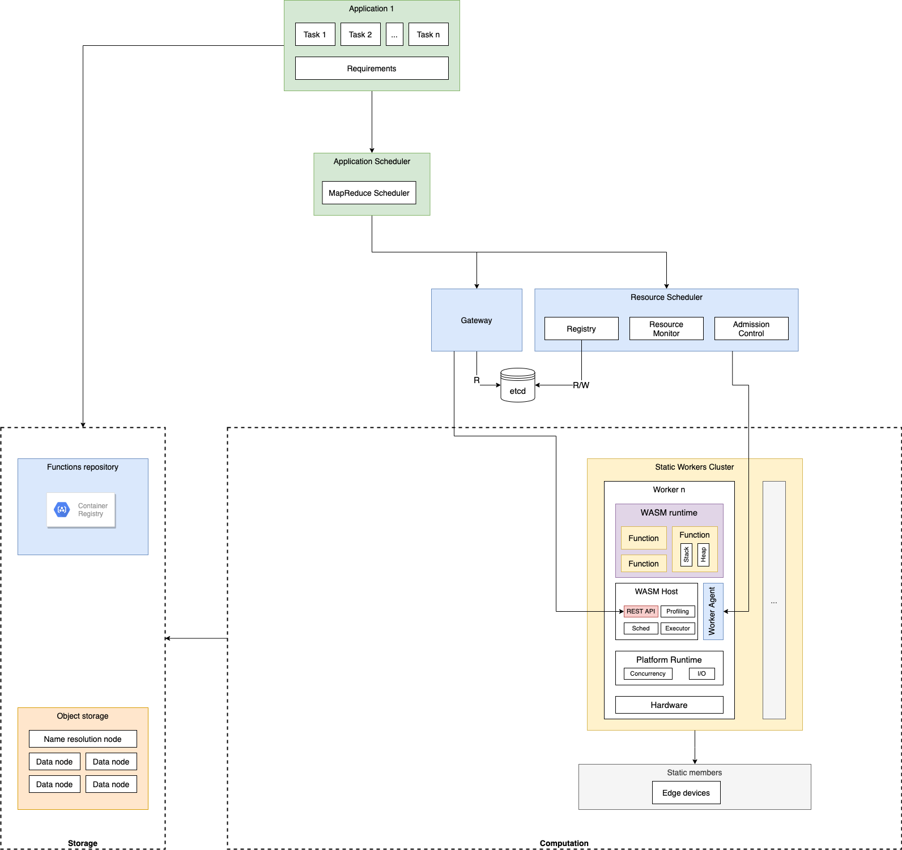

# Fedra

**_Il testo in corsivo da considerarsi come una vaga idea, senza fondamenta di approfondimento._**

## Scenario

- Degli amici sono in spiaggia a divertirsi. Per immortalare il momento decidono di realizzare una video (story) tutti insieme. Una volta registrato il video, l'applicazione chiede all'utente di aggiungere i tag delle altre persone o di confermare gli utenti suggeriti tramite analisi del video. Confermati i partecipanti del video, l'utente può decidere i filtri da applicare al video.
- La computazione dei filtri avviene in maniera distribuita tra i partecipanti del video, che divengono volunteer nella computazione previo consenso esplicito da parte loro. Il dispositivo utente da cui avviene l'editing elabora i requisiti della computazione e può partecipare nella computazione nei limiti delle sue risorse. Invia dunque i requisiti ad un orchestratore che si occuperà di trovare le risorse adeguate ed eseguire la computazione fino al raggiungimento dell'obiettivo. La distribuzione della computazione è un compito che richiede trasmissione sia di dati (il video) che di funzioni in quanto i filtri sono scaricabili e realizzabili dagli utenti di Instagram a disposizione per tutti tramite l'applicazione.
- Tuttavia per accelerare la computazione e risparmiare la batteria degli utenti, il software può richiedere la collaborazione di altri nodi nella rete dotati delle opportune risorse hardware (ad esempio GPU o CPU con istruzioni SIMD) tenendo in conto del vincolo di latenza.
- Ogni dispositivo del sistema che si registri come disponibile ad offrire computazione descrive le proprie capacità, fornendo informazioni quali potenza di calcolo disponibile e caratteristiche hardware come GPU, encoder/decoder di video/immagini, supporto istruzioni SIMD
- A seconda dei requisiti, ad esempio del filtro da applicare, un orchestratore decide quali siano i nodi di computazione del sistema più adatti.
- All'improvviso i diversi ragazzi ricevono avvisi sui propri cellulari riguardo ad un imminente pioggia in arrivo grazie ai sensori di meteo di cui sono dotati le loro case. Si dirigono allora verso le proprie case.
- Nel tragitto uno di loro continua l'editing del video in macchina, senza perdere il lavoro svolto prima. I dispositivi mobile dei ragazzi rimangono partecipanti nella computazione, mentre il cluster degli altri nodi di computazione cambia dinamicamente durante il movimento in base alla loro posizione geografica.
- Arrivati a casa di uno dei ragazzi, decidono di passare al desktop per avere uno schermo più grande con cui proseguire l'editing. A quel punto è il desktop che definisce i nuovi requisiti della computazione, sostituendo il dispositivo mobile che diviene semplice volunteer aggiuntivo e poiché sono collegati alla rete di casa, perfino il dispositivo IoT usato come sensore meteo può eseguire della computazione extra CPU o GPU.
- **Elementi innovativi**:
  - Computazione distribuita a partecipazione dinamica: i nodi dei ragazzi sono volunteer non sono fissi a priori e non conoscono le funzioni prima di unirsi alla computazione. Lavori precedenti di questo genere sono nell'ambito del **Volunteer Computing**.
  - L'applicazione utente definisce i requisiti della computazione e potenzialmente in futuro sono gli utenti che definiscono i requisiti. I cluster di computazione sono quindi disponibili a chiunque per qualsiasi genere di applicazione. Lavori simili di questo genere sono descritti da Yahoo con **YARN**, che permette agli utenti di sfruttare un cluster condiviso di computazione e il loro Distributed File System per scopi diversi, ad esempio ricerca accademica di algoritmi di indexing o Machine Learning.
  - Continuità dello stato della computazione. In questo caso il video a cui vengono applicati gli effetti rappresenta lo stato della computazione. Durante il viaggio di ritorno o durante il passaggio a desktop, l'utente prosegue l'editing del video senza interruzione e in maniera trasparente per l'utente.
  - Trasferimento di dati e funzioni. Le funzioni sono sia scaricabili dalla rete (pull) che trasmissibili da un nodo all'altro (push). **MapReduce** è un'architettura di questo genere, dove tuttavia le funzioni non sono portabili su dispositivi etereogenei con runtime diversi.
  - Continuità di computazione: la computazione prosegue anche quando gli utenti cambiano luogo geograficamente e coinvolge tutti i nodi della rete, che possono offrire computazione (mobile, desktop, cloud, IoT) o allo stesso tempo scaricare parte di computazione verso altri nodi (mobile, desktop).

## Architettura

- Una **Application** è un software che ha necessità di risorse per raggiungere un obiettivo. Può essere ad esempio un'applicazione web, mobile o microservice in cloud. Un'applicazione è composta di **Task**, la cui rappresentazione è una **funzione**. Il media type di questa rappresentazione è WASM o un formato comprendente WASM, ad esempio un container.
  - Le funzioni sono registrate nel **Functions Repository** da parte dell'Application.
  - Un **Requirement** è una descrizione formale delle risorse richieste da una Application. Ad esempio contiene le informazioni sulle funzioni quali i requisiti di memoria RAM di ciascuna funzione, le capabilities richieste (ad esempio HTTP server handle), e potenzialmente altre informazioni come la descrizione delle dipendenze tra funzioni.
    - Vi sono diversi modi di specificare le dipendenze tra funzioni, ad esempio come gruppi di Task dipendenti nello stesso nodo (Pod) in Kubernetes, oppure come grafo nel caso di Microsoft Apollo.
    - Un altro esempio di Requirement potrebbe essere [AWS Cloudformation](https://aws.amazon.com/it/cloudformation/), che offre sia API che template statico per fare provisioning automatico delle risorse necessarie in un sistema distribuito su AWS.
    - L'esempio preferito attualmente è il modello **MapReduce** di Google. Permette alle applicazioni di descrivere facilmente una specifica della computazione tramite combinazione di funzioni Map `(key, value) => list(key, value)` e Reduce `(key, list(value)) => list(value)`.
      - Fornisce un modello di programmazione semplice senza che le applicazioni debbano preoccuparsi dei problemi della computazione distribuita.
      - È un modello di computazione distribuita che si è dimostrata flessibile per diverse tipologie di problemi.
      - Si presta bene anche come caso d'uso per il resto dell'architettura. I nodi **Workers** ricevono in ingresso i dati input e la funzione Map/Reduce.
      - Chi si occupa però dell'orchestrazione delle funzioni MapReduce? Ovvero c'è bisogno di assegnare le funzioni Map ed i dati ai Workers, aggregare gli output intermedi, fare split di questi per chiave ed inviarli ai Worker con funzioni Reduce. Non può essere l'**Orchestrator** classico alla Kubernetes in quanto è generico rispetto all'Application ed inoltre non potrebbe contenere tutti gli stati di computazione delle diverse Application. La scelta ritenuta più ragionevole al momento è utilizzare uno **scheduling a due livelli**, diviso in **Application Scheduler** e **Resource Scheduler**. Descritto più in avanti.
      - Rimane comunque il problema di dove salvare i dati di computazione intermedi. Se si suppone che le Application avranno requisiti compute-intensive e non data-intensive si potrebbe salvare lo stato intermedio nell'Application Scheduler. Questo però limiterebbe il genere di applicazioni eseguibili nel sistema. Un'altra alternativa sarebbe usare nodi storage, ad esempio un nodo Blob Storage o Key-Value Storage, ma questi in genere sono presenti in datacenter del cloud e non all'edge. 
      - Invece un distributed file system (DFS) potrebbe essere la soluzione migliore.
        - In particolare dovrebbe essere un DFS in cui i Workers possono leggere e scrivere i dati su nodi DFS fisicamente vicini.
        - Non sono necessarie copie repliche in quanto sono dati intermedi che una volta letti ed usati possono essere cancellati. In caso di fallimento i Workers o l'Application sono in grado di rifornire i dati, eventualmente ricalcolandoli.
        - Continuità di stato: deve essere possibile tuttavia accedere ai dati da qualsiasi posizione geografica, soprattutto in mobilità quando gli utenti cambiano cluster. In tal caso è necessario uno spostamento dei dati verso il nuovo cluster. Una buona idea potrebbe essere un meccanismo simile al namespacing per il DFS. I Workers richiedono i dati usando un URL e contattando un nodo del cluster in grado di fare la risoluzione del namespace. Se il file non è presente nel cluster allora la richiesta viene propagata ad un nodo con maggiori informazioni globali e così via fino a fare risoluzione dell'effettivo cluster che contiene i dati. Quest'ultimi vengono quindi spostati verso il cluster corrente in cui si trova l'utente. **DA APPROFONDIRE**
    - *Invece di inviare la coppia `(dati input: raw, funzione: URL)`, si potrebbe inviare la tripletta `(dati input: URL, funzione: URL, locazione dell'output: URL)`. L'URL permette di definire il protocollo e locazione dove poter leggere o salvare i dati. L'idea arriva dal concetto ["Everything is a URL" di Redox](https://doc.redox-os.org/book/ch04-04-urls.html).* Un altro esempio sono i pre-signed URLs di AWS che permettono di leggere e scrivere in maniera ristretta sullo storage S3.
- **Functions Repository**: è un registro delle funzioni identificabili in maniera univoca come risorsa URL. Le funzioni hanno una scadenza automatica se non sono state usate ad esempio nelle ultime 24h. Il Repository è geograficamente vicino ai Workers per migliorare il tempo di risposta e fa parte del DFS.
  - L'idea è avere un registry di funzioni simili alle immagini dei container ma molto più minimali ancora, sull'ordine di magari decine o centinaia di KB invece che decine di MB. Ad esempio potrebbe contenere solo la funzione + metadati + token di sicurezza, mentre altri files comunemente inclusi in una image sono su altri nodi del DFS.
- L'**Orchestrator** è diviso in due livelli. Il livello **Application Scheduler** si occupa di fare scheduling delle funzioni, mentre il **Resource Scheduler** è responsabile dell'assegnazione dei nodi Workers e del monitoraggio del loro stato di disponibilità. L'architettura è ispirata da Apache Mesos e Apache YARN.
  - I requisiti dell'Orchestrator sono:
    1. Scalabilità/Availability
    2. Multi-tenancy: deve supportare più Application con diverse esigenze contemporaneamente
    3. Locality awareness: deve permettere di coordinare tenendo in conto della posizione geografica dell'Application, dei dati e dei Workers
    4. High-utilization del cluster
    5. Affidabilità: il fallimento di un nodo, seppur importante quanto uno scheduler, non deve comportare la perdita di tutte le funzioni di tutte le Application.
    6. Sicurezza e auditing delle operazioni
    7. Supporto per diversità di modelli di programmazione: MapReduce è solo uno di questi, deve essere possibile implementare altri modelli più adatti per ad esempio Machine Learning (Spark).
  - Questa architettura rende flessibile lo scheduling dei Workers per diversi tipi di Application. In particolare funziona meglio per tipologie di tasks a breve termine, che non occupino la risorsa a lungo e permettano un'efficiente bin-packing nei nodi. Questo sembra essere proprio il caso di Workers situati su nodi embedded o browser, il cui tempo di vita è breve (ad esempio sull'ordine di pochi secondi-1min).
  - L'**Application Scheduler** riceve le informazioni dei nodi Worker disponibili con le caratteristiche richiede e decide come assegnare le funzioni ai nodi. Punta a fare load balancing tra i Workers, ma allo stesso tempo cerca di fare cache-hit con Workers che abbiano già in cache la funzione per migliorare il tempo di risposta.
    - L'Application Scheduler **NON** è definito dal sistema, ovvero è definibile dagli utenti per permettere maggiore flessibilità di Applicazioni.
    - Avere l'Application Scheduler disaccoppiato dal Resource Scheduler permette però di coordinare in maniera efficiente dipendenze e comunicazioni tra funzioni, aspetto oggi non possibile con serverless.
    - L'Application Scheduler esegue su un nodo fog del cluster. L'Application richiede al Resource Scheduler di attivare un Application Scheduler scaricando una funzione dal Functions registry ed eseguirli come servizio long-running su un nodo fog del cluster. Le informazioni per contattare il nodo sono quindi ritornate all'Application. L'utente è responsabile della gestione del fault-tolerancy dell'Application Scheduler, ma potrebbe essere almeno aiutato usando una libreria oppure nodi storage fault-tolerant offerti dal Resource Scheduler per salvare e ripristinare lo stato dello scheduling.
  - Il **Resource Scheduler**, su richiesta dell'Application Scheduler, che a sua volta si basa sui Requirements dell'Application, risponde con un **leasing** contenente le informazioni dei nodi Worker che meglio soddisfanno i requisiti. Per fare ciò mantiene un **Registry** dei Worker attivi. Esegue quindi una query verso il Registry per conoscere i Workers disponibili.
    -  Preferisce nodi geograficamente vicino ai dati. Inoltre deve essere cosciente delle capabilities richieste ai Workers. Aggiorna la parte di **Resource Management** del Registry una volta presa una decisione.
    - È consentito condividere un Worker tra più richieste di diversi Application Schedulers.
    - Gestisce anche le chiavi che permettano l'autenticazione e autorizzazione per la comunicazione tra Application Scheduler e Workers.
    - Il Resource Scheduler è di tipologia decentralizzato monolite, ovvero esistono diverse repliche distribuite dello Scheduler che gestiscono una porzione delle richieste ma implementano le stesse policies. In questo modo si è in grado di offrire high-availability agli Application Schedulers. È la tipologia di Kubernetes e Docker Swarm.
    - Ogni cluster è dotato di Resource Scheduler leader con repliche follower e _**non vi è sovrapposizione tra cluster di Resource Scheduler leader diversi**_. Le risorse in un cluster sono principalmente statiche salvo fallimenti hardware, in quanto costituiti principalmente da dispositivi embedded e fog. Lo Scheduler cerca di sfruttare al pieno possibile le risorse di cui dispone.
    - Il Resource Scheduler è agnostico della finalità dei Worker, tratta il cluster di risorse eterogenee come un continuum
    - I requisiti di risorse RAM possono essere specificati in maniera granulare grazie al determinismo di esecuzione dei moduli WASM, in particolare usando runtime di linguaggi senza garbage-collector come Rust. Questo aspetto, unito al basso overhead di memoria dei moduli WASM, permette un maggior utilizzo delle risorse nei cluster, permettendo di eseguire più moduli sullo stesso nodo.
    - In una versione avanzata di Resource Scheduler, è possibile salvare lo stato di memoria di una funzione. Questo può essere utile per fare preemption oppure per migrare la computazione verso un altro Worker. 
  - L'**Admission Control** determina la soddisfacibilità dei Requirements, può quindi negare la richiesta nel caso in cui il cluster non disponga delle risorse necessarie per soddisfare i Requirements.
  - Il **Registry** contiene lo stato del sistema distribuito, ad esempio le locazioni dei Workers ed il loro stato di disponibilità. È necessario quindi un servizio di distributed state sincronizzato come `etcd` o ZooKeeper.
    - Contiene anche le informazioni per adempiere il ruolo da **Resource manager**. L'esecuzione delle funzioni è stateless e non richiede che rimanga attiva alcuna risorsa al termine dell'esecuzione, esattamente come avviene per funzioni serverless. Tuttavia il Resource Manager mantiene informazioni quali utilizzo di RAM, memoria persistente e quante funzioni e di quale Application sono già attive nei Workers.
  - **Gateway**: l'idea è che l'invio di funzioni e dati non coinvolga il Resource Scheduler, ma allo stesso tempo l'Application Scheduler non comunichi direttamente con i Workers, per ad esempio supportare il fallimento di un Worker senza che sia a carico dell'Application Scheduler.
    - Il Resource Scheduler ritorna all'Application Scheduler le informazioni dei Workers con cui può comunicare come risorse REST assieme all'URL del Gateway. L'Application Scheduler invierà quindi dati e URL delle funzioni via il Gateway attraverso richieste REST. Il Gateway fa risoluzione dei Workers leggendo dallo storage del Registry, salva in cache il mapping nomi-nodo fisico, ed inoltra le richieste.
    - Il load balancing non viene fatto dal Gateway rispetto ad un classico gateway in quanto si immagina sia più efficiente se l'Application Scheduler designa in anticipo i Workers sulla base dei propri Requirements, invece che lasciare la decisione al Gateway "on-the-fly" sulla base della singola richiesta REST. Di contro sarebbe più semplice per l'Application Scheduler non dover occuparsi del load balancing, però in ogni caso si occupa già di decidere ad esempio quali Workers usare per Map e quali per Reduce, con addirittura eventuali Worker come intermedi per lavorare sui dati intermedi.
- Un **Worker** è un nodo in grado di offrire capacità di computazione ad altri nodi del sistema. È in grado di descrivere le proprie capacità di computazione, come supporto a semplici operazioni CPU, operazioni a virgola mobile via FPU, operazioni SIMD o operazioni GPU.
  - Il **Platform Runtime** dipende dal dispositivo ed offre le chiamate di sistema per la concorrenza e l'I/O, che sono i due requisiti minimali. La concorrenza serve per eseguire più funzioni contemporaneamente, l'I/O per comunicare in rete via REST. Esempi di meccanismi di concorrenza offerti dalla piattaforma sono processi o thread (OS), Ada/[RTIC](https://rtic.rs/0.5/book/en/) task (embedded), WebWorker (browser). Esempi di I/O sono REST via HTTP 1.1 + TCP/IP, REST via HTTP 3 + QUIC o REST via COAP + UDP.
    - Le funzioni non sono preemptable al momento, quindi non è richiesta preemption al runtime. Il motivo è perché le funzioni non sono long-running. Tuttavia deve essere possibile killare una funzione, ad esempio quando il leasing scade.
    - _Dovrebbe avere anche una Resource Policy nel caso si possa in futuro condividere memoria tra funzioni_.
  - Il **Worker agent** comunica con l'Application Scheduler per aggiornare lo stato di disponibilità. Un esempio è il `kubelet` di Kubernetes. È dall'aggregazione delle informazioni inviate dai singoli Worker agent che il Resource Scheduler costruisce lo stato del cluster.
  - Il **WASM Host** fornisce operazioni sul runtime HOST come risorse REST per l'Application Scheduler o come chiamate API per il Worker Agent.
    - Espone endpoint REST che descrive le proprie risorse
    - Espone anche endpoint REST che permette di aggiungere una funzione URL e relativi dati ad una coda di job. La funzione viene scaricata dal Functions repository e messa in cache in caso di ulteriori richieste future. La coda permette invece di ridurre il tempo di attesa tra un job e l'altra.
    - Il WASM Host potrebbe essere esteso con una function **Worker Executor** definita dall'Application Scheduler che permetta di semplificare la migrazione di Application Scheduler esistenti come Hadoop che assumono un processo specifico (TaskTracker) nei nodi Worker. Internamente l'Executor utilizza le API fornite dal WASM Host facendo da adapter.
  - Il **WASM Runtime** è l'ambiente di esecuzione virtuale delle funzioni. Se il Worker utilizza un interprete allora la funzione non è istanziata, altrimenti se utilizza un compilatore JIT o AOT l'istanza viene preservata per qualche minuto per permettere riuso più veloce.
    - Può avviare più functions in parallelo sfruttando l'isolamento di memoria offerto da WASM e il meccanismo di concorrenza del runtime.
    - La funzione implementa internamente stack e heap secondo il runtime di linguaggio ed usando la memoria lineare WASM.
  - Vale davvero la pena avere nodi Workers sui browsers? Chiaramente poter sfruttare tutta la potenza mobile sarebbe molto vantaggiosa, ma ci sono diversi limiti tecnologici con i browser.
    - Non è possibile eseguire attività in background se la pagina non è attiva, anche (ab)usando tecnologie come `BackgroundSync` e `ServiceWorker`.
    - Un browser non può divenire un server che espone endpoint REST. Per comunicare col browser bisogna usare il protocollo WebSocket. WebRTC è solo tra browsers. WebSocket significa che un server deve rimanere attivo per inoltrare le richieste dall'Application Orchestrator al Worker. Questo server potrebbe essere direttamente il Gateway ma rischia di diventare bottleneck. Un server intermediario in più invece peggiorerebbe la latenza e complicherebbe il sistema. L'idea migliore al momento è che l'Application Scheduler gestisca direttamente la comunicazione con i browser Workers, in quanto la loro partecipazione alla computazione è già dipendente dall'applicazione. Ad esempio Instagram valuta se coinvolgere i nodi dei partecipanti in base alla conferma degli utenti.
  - Discorso analogo per in generale mobile, anche nativo. Le applicazioni sono sempre limitate nelle attività background ed inoltre l'interesse verso aiutare computazioni di terzi è di interesse limitato per le persone. Si distingue quindi tra Workers a **partecipazione dinamica** e a **partecipazione statica**. I nodi a partecipazione dinamica, ovvero browser o nativo (desktop/laptop, mobile, tablet), si collegano via WebSocket all'Application Orchestrator e la comunicazione tra le due parti è diretta. Non hanno bisogno di Resource Scheduler in quanto non sono multi-tenant. La fault tolerancy viene invece gestita dall'Application Scheduler e quest'ultima può decidere di semplicemente non coinvolgere i nodi utenti dell'Application.

## Contorno di tesi

Per evitare la "second system syndrome", la tesi cercherà di riusare al più possibili soluzioni software esistenti senza snaturare l'architettura del sistema.

Premesso ciò, la tesi punta a sviluppare i seguenti punti dell'architettura precedente:

- Lo stack software all'interno di un nodo Worker su dispositivi embedded (STM32F4).
  - Il platform runtime per la concorrenza sarà basato ad esempio su [RTIC](https://rtic.rs/0.5/book/en/).
  - Lo stack IO invece implementerà il protocollo CoAP usando un'implementazione Rust no_std esistente opportuna
  - Il Worker Agent utilizza [krustlet](https://github.com/deislabs/krustlet), eventualmente collaborando col team che è già interessato a supportare ARM32
  - WASM Host sarà basato su una versione minimale di [wascc-host](https://github.com/wascc/wascc-host) che funzioni no_std e con supporto basilare a capability come solo `REST server handle`. 
  - Il WASM runtime utilizza [wasm3](https://github.com/wasm3/wasm3) con requisiti minimali 64Kb flash, 10Kb RAM. Non vi è supporto ad istruzioni SIMD o tail-call optimization
- Lo stack software all'interno di un browser:
  - Il platform runtime per la concorrenza sarà basato sui [WebWorker](https://developer.mozilla.org/en-US/docs/Web/API/Web_Workers_API/Using_web_workers) molto probabilmente
  - *Lo stack IO invece cercherà di implementare "REST over WebSockets"*
  - Il WASM Host sarà scritto da zero sulla base di quello nei dispositivi embedded ed eseguirà nel main thread di JS
  - Il WASM runtime sarà quello built-in nei browser, con supporto sperimentale in Chrome per istruzioni SIMD
- Entrambi gli stack software all'interno di nodi Worker avranno un semplice scheduler che assegna la stessa priorità a tutte le funzioni e cerca di ottenere un'esecuzione fair.
- Il Functions repository sarà invece basato su [Gantry](https://github.com/wascc/gantry) di Wascc
- Non vi è un'implementazione di DFS. L'Application avrà un caso d'uso CPU-intensive dove i dati possono essere passati interamente durante la richiesta REST.
- Il Resource Scheduler sarà basato possibilmente su Kubernetes, in particolare [microk8s](https://github.com/ubuntu/microk8s). Si intende sostituire il daemon scheduler con uno custom.
  - Il motivo per cui si preferisce Kubernetes rispetto a soluzioni esistenti 2-layer, ovvero Mesos e YARN, è dato dalle seguenti motivazioni:
    - Mesos ha un'architettura offer-based dove è il Resource Scheduler a fare offerte di risorse che gli Application Scheduler accettano oppure attendono in attesa della prossima offerta. Ciò si ritiene sia inadatto per computazioni eteronegee (CPU + GPU) e a basso response time.
    - YARN è implementato in Java e fortemente integrato nella codebase di Hadoop. *Si ritiene sia difficile integrarlo nell'architettura proposta*.
    - K8s ha una community molto vasta, in particolare in crescita in Rust
    - Una forte motivazione è data dalla possibilità di utilizzare `krustlet` come Worker Agent senza doverlo scrivere da zero come è nel caso di YARN. Inoltre gli autori di `krustlet` sono già disponibili ed interessati a supportare dispositivi embedded, rendendo il coordinamento e l'effort più semplice
    - Può essere usato `etcd` come stato distribuito consistente per il coordinamento. ZooKeeper ha la fama di essere difficile da usare.
- L'Application Scheduler sarà un porting di Hadoop usando il pluggable scheduler. Questo richiederebbe di usare un container per il servizio invece che una function. Inoltre non è chiaro se serva riscrivere il `TaskTracker`, probabilmente come Worker Executor.
  - Usare un container per il servizio richiederebbe avere nodi con VM Linux ed un registro Docker. Ma l'overhead implementativo probabilmente vale la pena rispetto al migrare un application framework esistente come Hadoop. Sarebbe sicuramente poco pratico per supportare eventualmente in futuro ulteriori scheduler come Spark.
  - Implementa una comunicazione via WebSocket con i Worker browser
- L'Application è un'implementazione dell'algoritmo "Rainbow Table Generation" per eseguire un attacco brute force ad una password. Richiede una tabella di hash che può essere salvata in memoria nell'Application Scheduler e i Worker ricevono semplicemente una stringa ed una funzione.
  - L'algoritmo permette una comparazione come tempo di esecuzione rispetto a soluzioni Volunteer Computing esistenti
  - Per un confronto significativo con benchmark MapReduce serve purtroppo implementare un POC del DFS essendo le applicazioni in genere data-intensive, come anche un semplice Word Count.
- Un'Application più interessante, rimanendo compute-intensive, è [ExCamera](https://www.usenix.org/system/files/conference/nsdi17/nsdi17-fouladi.pdf) che è un sistema di video processing a bassa latenza basato su migliaia di piccole funzioni parallele. Attualmente è implementato dagli autori usando AWS Lambda, per cui si presta bene ad essere migrato verso Workers. **DA APPROFONDIRE**
- Se Fedra è il nome del runtime sui nodi Workers, serve un nome per il sistema descritto dall'architettura: Egeo, il mare comprendente le isole a cui appartiene anche Creta.

## Implementazioni esistenti

  - [FAASM](https://www.usenix.org/conference/atc20/presentation/shillaker)
    - Orientato per HPC con stato globale condiviso e strategie per condividere anche lo stato locale. Tuttavia è orientato per il serverless, ovvero provisioning delle risorse per una sola funzione per applicazione, mentre lo scenario della tesi presenta diverse funzioni coordinate appartenenti ad un'applicazione.
    - Esegue come processo Linux, di cui sfrutta i meccanismi di sicurezza come namespace e iptables. Inadatto quindi per embedded.
    - Seppur abbia un meccanismo di state globale, non ha convinto personalmente dal punto di vista tecnologico. Ad esempio l'utilizzo esplicito di un lock per leggere e scrivere globalmente è sospetto.
  - [Wascc Lattice](https://wascc.dev/docs/lattice/howitworks/)

    

    - L'immagine sopra è un Lattice globale, dove ogni funzione è un attore e le capabilities sono processi separati con cui gli attori comunicano via messaggio. I messaggi sono inviati via protocollo NATS.

    .png>)

    - L'immagine sopra descrive una rete Lattice dove i nodi sono orchestrati da Kubernetes tramite la libreria [Krustlet](https://github.com/deislabs/krustlet) installata su ogni nodo. I nodi però comunicano tra di loro via [NATS](https://nats.io/) senza Kubernetes. Il reticolo rappresenta un gioco alla [crobots](https://en.wikipedia.org/wiki/Crobots) con player distribuiti, ognuno avente una strategia diversa.
    - Il Lattice di Wascc è l'implementazione più vicina al sistema dello scenario descritto. Possiede infatti nodi distribuiti nella rete, che eseguono codice eterogeneo portabile WASM. Wascc inoltre supporta anche hot swapping dei moduli attori senza downtime.
    - I suoi difetti sono tuttavia possibilmente i seguenti:
      - Non è pensato per il sistema dello scenario, ad esempio non sono presenti nodi browser. Quest'ultimi si limitano a mostrare l'interfaccia del gioco (WebUI in immagine), senza essere parte del sistema.
      - È orchestrato da Kubernetes che si occupa di fare provisioning, non di decidere, comporre e governare i nodi necessari per un workflow come nel caso dell'Application Scheduler.
        - Tuttavia in realtà il Lattice Wascc non assume utilizzo necessariamente con Kubernetes. I nodi comunicano direttamente tra di loro utilizzando NATS attraverso un Gateway globale.
      - Comunica via messaggi tramite protocollo NATS. Questa forma di comunicazione non è ricca come REST, che permette di definire in maniera uniforme risorse e servizi assieme ad una interfaccia comune per operare su questi. Ciò è fondamentale per un sistema eterogeneo come quello della tesi. Inoltre non è verificata la bontà del protocollo NATS per dispositivi embedded, rispetto ad esempio CoAP.
        - Un difetto importante di NATS o comunicazioni message-based come MQTT o AMQP rispetto a REST è la possibilità per quest'ultimi di avere nodi intermediari. I nodi intermediari permettono maggiore flessibilità del sistema e questo è possibile solo tramite REST, via ad esempio HTTP. Un Gateway può ad esempio analizzare solo l'URL della richiesta per decidere l'instradamento oppure trasformarla modificando opportuni Headers. Non è chiaro se questo sia possibile con messaggi, sicuramente trasmessi in binario, ma si ritiene di no o sarebbe meno efficiente. Ad esempio la flessibilità di REST permette di usare WebSocket, HTTP o CoAP in base alle capacità di rete del dispositivo. **DA APPROFONDIRE**

TODO:
- Calendario
- Benchmark sintentici
